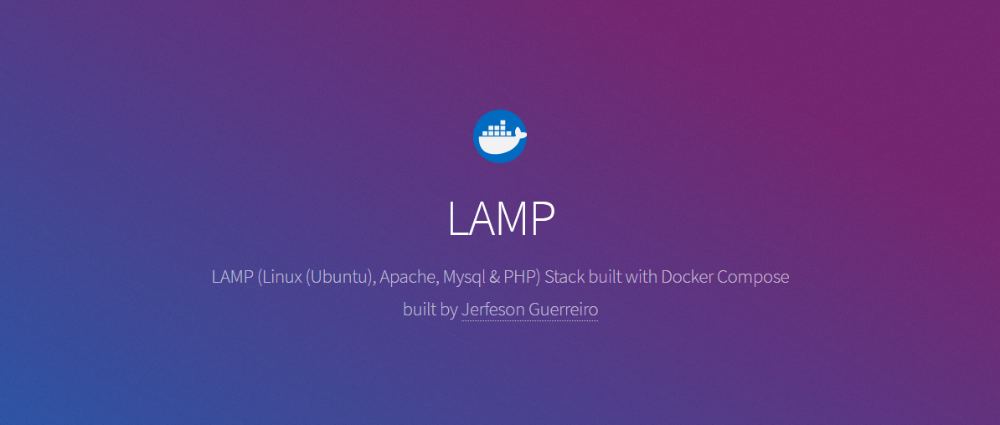

# LAMP (Linux(Ubuntu), Apache, Mysql & PHP) stack built with Docker Compose

This is a basic ALAMP stack environment built using Docker Compose. It consists following:

- PHP [5.6.X][], [7.2.X][], [7.3.X][]
- Apache 2.4
- MySQL 5.7
- phpMyAdmin
- Redis
- Blackfire.io

## Use appropriate branch as per your php version needed:

* [5.6.x][]
* [7.2.x][]
* [7.3.x][]

## Configuration and Usage

Please read from appropriate version branch.

## Contributing

welcome to discuss a bugs, features and ideas.

## License

jerfeson/docker-compose-lamp is release under the MIT license.

[5.6.x]:https://github.com/jerfeson/docker-compose-lamp/tree/5.6.x
[7.2.x]:https://github.com/jerfeson/docker-compose-lamp/tree/7.2.x
[7.3.x]:https://github.com/jerfeson/docker-compose-lamp/tree/7.3.x