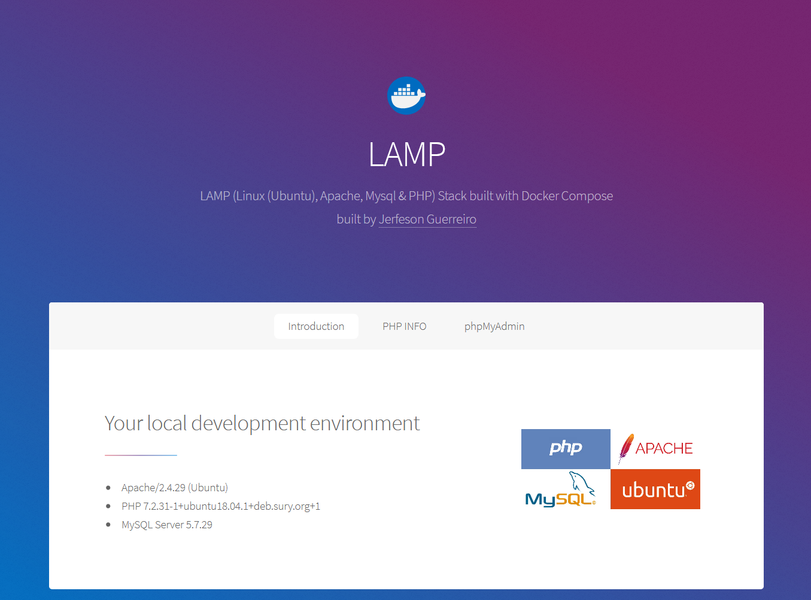

# LAMP (Linux (Ubuntu), Apache, Mysql & PHP) stack built with Docker Compose



This is a basic #LAMP stack environment built using Docker Compose. It consists following:

- PHP 7.2.X
- Apache 
- MySQL 5.7
- phpMyAdmin
- Redis
- Blackfire

## Installation
Clone this repository on your local computer. Run the `docker-compose up -d`.

```shell
git clone https://github.com/jerfeson/docker-compose-lamp.git
cd docker-compose-lamp/
git fetch --all
git checkout 7.2.x
cp sample.env .env
docker-compose up -d
```
> Please make sure that you are using `7.2.x` branch.

Your #LAMP stack is now ready!! You can access it via `http://localhost`.

## Configuration

To make it easy, just copy the content from `sample.env` file and update the environment variable values as per your need.

### Configuration Variables

There are following configuration variables available and you can customize them by overwritting in your own `.env` file.

_**DOCUMENT_ROOT**_

It is a document root for Apache server. The default value for this is `./www`. All your sites will go here and will be synced automatically.

_**MYSQL_DATA_DIR**_

This is MySQL data directory. The default value for this is `./data/mysql`. All your MySQL data files will be stored here.

_**VHOSTS_DIR**_

This is for virtual hosts. The default value for this is `./config/apache/vhosts`. You can place your virtual hosts conf files here.

> Make sure you add an entry to your system's `hosts` file for each virtual host.

_**APACHE_LOG_DIR**_

This will be used to store Apache logs. The default value for this is `./logs/apache2`.

_**MYSQL_LOG_DIR**_

This will be used to store Apache logs. The default value for this is `./logs/mysql`.

## Web Server

Apache is configured to run on port 80. So, you can access it via `http://localhost`.

#### Apache Modules

By default following modules are enabled.

> RewriteEngine

#### Connect via SSH

You can connect to web server using `docker-compose exec` command to perform various operation on it. Use below command to login to container via ssh.

```shell
docker-compose exec webserver bash
```
## PHP

The installed version of PHP is 7.2.x

By default following extensions are installed.

- dev
- cli
- common
- gd
- json
- pear
- mbstring
- mysql
- pdo
- redis
- soap
- xdebug
- xml
- xmlrpc

> If you want to install more extension, just update `./bin/webserver/Dockerfile`. You can also generate a PR and we will merge if seems good for general purpose.
> You have to rebuild the docker image by running `docker-compose build` and restart the docker containers.

## phpMyAdmin

phpMyAdmin is configured to run on port 8080. Use following default credentials.

http://localhost:8080/  
username: root  
password: root

## Redis

It comes with Redis. It runs on default port `6379`.

## Contributing

welcome to discuss a bugs, features and ideas.

## License

jerfeson/docker-compose-lamp is release under the MIT license.